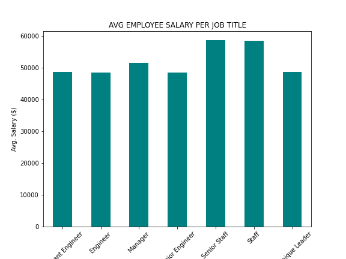
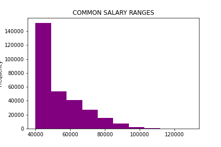

# sql-data_engineering
 * Create an image file of your ERD.  * Create a `.sql` file of your table schemata.  * Create a `.sql` file of your queries.  * (Optional) Create a Jupyter Notebook of the bonus analysis.

