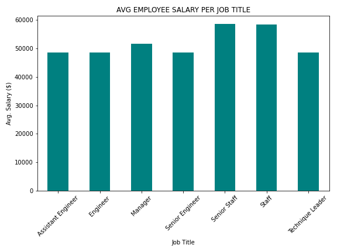
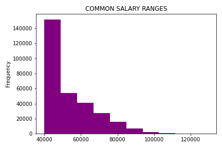

# sql-data_engineering
 * Create an image file of your ERD.  * Create a `.sql` file of your table schemata.  * Create a `.sql` file of your queries.  * (Optional) Create a Jupyter Notebook of the bonus analysis.

The bar graph shows the average employee salary of each job title since the store has begun keeping track of their employee data.  

The historgram shows the common salary ranges for the employees of the store. The histogram clearly demostates that the most common salary range is $40,000 to 50,000. 

When investigating further: 
  $40,000 is found to be the most common salary with 95,346 employees earning this amount.  
  $48,681 is found to be 50% of the salary range,
  $61,758 is 75%,
  $129,492 is the max salary.
  Which shows the salary range for the store is skewed toward the lower end, a lot of lower paid employees working for a couple high paid bosses.

